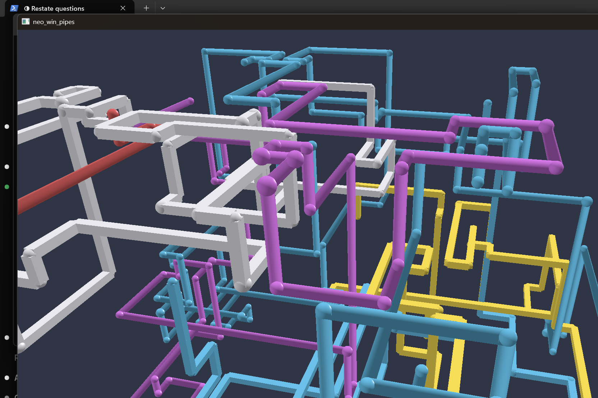

# neo_win_pipes

[](https://github.com/brando5393/neo_win_pipes/actions/workflows/ci.yml)

A modern, cross-platform (Windows / macOS / Linux) recreation of the
classic Windows "3D Pipes" screensaver — the chrome pipes one, from Windows
NT 4.0 onward. Goal: an installable, OS-selectable screensaver on all three
platforms, built on a fully unit-tested Rust simulation core.

**Status: Phase 4 (Windows) — a real, double-click-installable Windows
screensaver that updates itself.** `neo_win_pipes.msi` installs the `.scr`
(`/s`/`/c`/`/p <hwnd>` contract, fully understood) into `System32` and the
"Pipes Settings" app (live preview + settings drawer) into Program Files
with Start Menu shortcuts (including uninstall) — no manual file copying.
Pushing a version tag publishes a new release automatically, and
installed copies notice and offer a one-click update — free, no paid
update host or background service, just GitHub's own Releases API (one
UAC prompt per update is unavoidable, since the screensaver lives in
`System32`). macOS/Linux aren't installable screensavers yet (Linux has
tested argument parsing; macOS is design-only so far — see
[`docs/ROADMAP.md`](docs/ROADMAP.md) for the honest per-platform
breakdown and what's next).



## Quick start

```sh
cargo test --workspace                  # run the full test suite (55 tests)
cargo run -p pipes-app -- --seed 1      # the screensaver itself
cargo run -p pipes-app -- /s            # ...or exercise the real Windows contract directly
cargo run -p pipes-settings             # live preview + settings drawer
```

See [`docs/DEVELOPMENT.md`](docs/DEVELOPMENT.md) for prerequisites
(including a Windows-on-ARM64 build caveat and how to build the `.msi`)
and [`docs/USAGE.md`](docs/USAGE.md) for CLI flags, environment
variables, and how to install it as your actual screensaver.

## Documentation

| Doc | Covers |
|-----|--------|
| [`docs/RESEARCH.md`](docs/RESEARCH.md) | What the original screensaver actually did, and sources. |
| [`docs/FEATURE_IDEAS.md`](docs/FEATURE_IDEAS.md) | Community-sourced backlog — what users of prior pipes projects actually asked for. |
| [`docs/ARCHITECTURE.md`](docs/ARCHITECTURE.md) | Crate layout, why the core has no rendering deps. |
| [`docs/ROADMAP.md`](docs/ROADMAP.md) | Phased plan from headless core to installable packages. |
| [`docs/DEVELOPMENT.md`](docs/DEVELOPMENT.md) | Build/test setup, testing philosophy, contribution rules. |
| [`docs/USAGE.md`](docs/USAGE.md) | How to run what exists today. |
| [`docs/LOGGING.md`](docs/LOGGING.md) | The human-readable log event catalog. |
| [`CLAUDE.md`](CLAUDE.md) | Conventions for AI-assisted work in this repo. |

## License

MIT — see [`LICENSE`](LICENSE).
